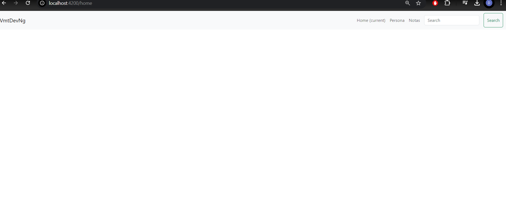
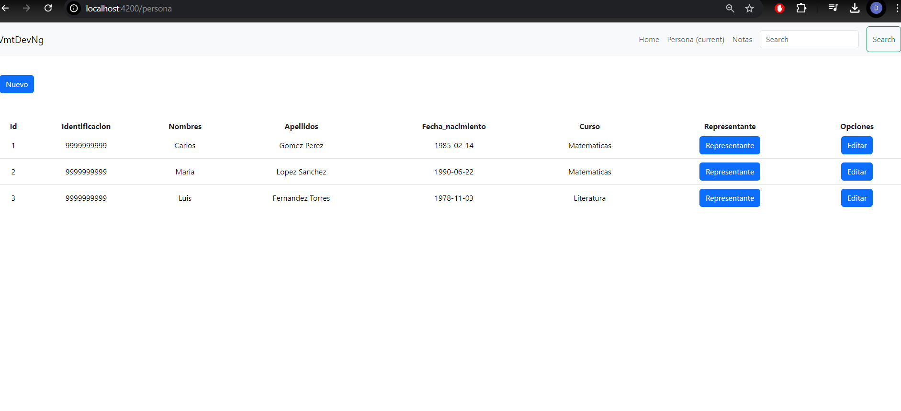
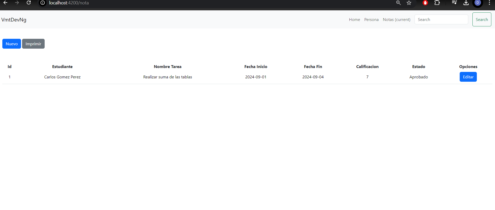
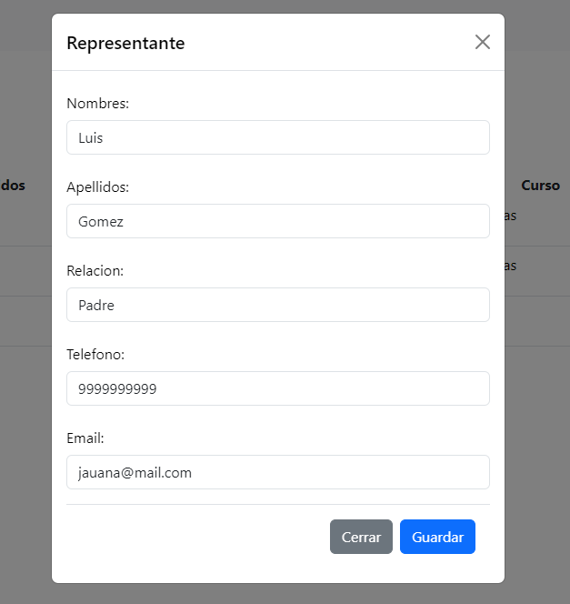

# Deber N1 - TAREA DE ESTUDIANTES

## Requerimientos:

Realizar un módulo con componentes interactivos para el ingreso de estudiantes, representantes y calificaciones:
```
Para los datos del estudiante considerar los siguientes datos:

* Identificación
* Nombres
* Apellidos
* Fecha de nacimiento
* Curso

Para el ingreso de representantes considerar los siguientes datos:
* Nombres y apellidos
* Relación (Padre, madre, tío, etc...)
* Teléfono
* Email (Opcional)

```

LAS CALIFICACIONES SE MOSTRARÁN EN UNA TABLA Y SE DEBEN INGRESAR CON UN MODAL HACIA LA TABLA.

```

Para el ingreso de calificaciones considerar los siguientes datos:

* Nombre de tarea
* Descripción de tarea
* Fecha de inicio
* Fecha fin
* Calificación
* Estado (Si es 7 o mayor a 7 “Aprobado” ; Meno a 7 “Reprobado”) Se calcula en base a los datos ingresados en el modal

Todos los datos deben mostrarse en un JSON en consola con el resultado obtenido.

```

## SUBIR LA TAREA CON EL CORRESPONDIENTE README.

## INTEGRANTE: 
* Derek Mejía

## CAPTURAS









## FIN